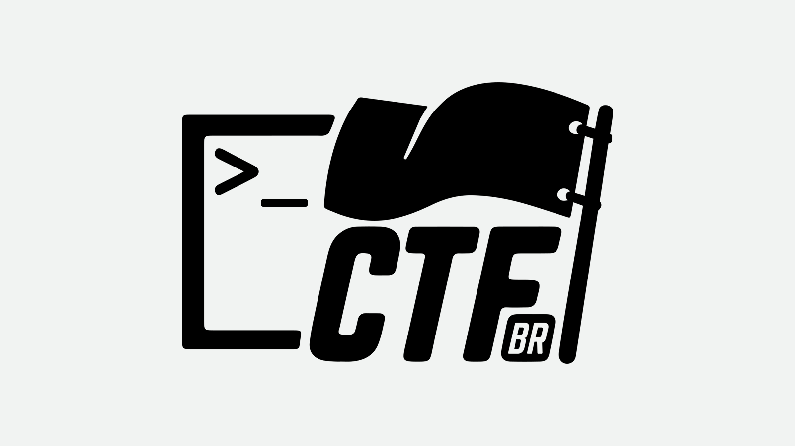
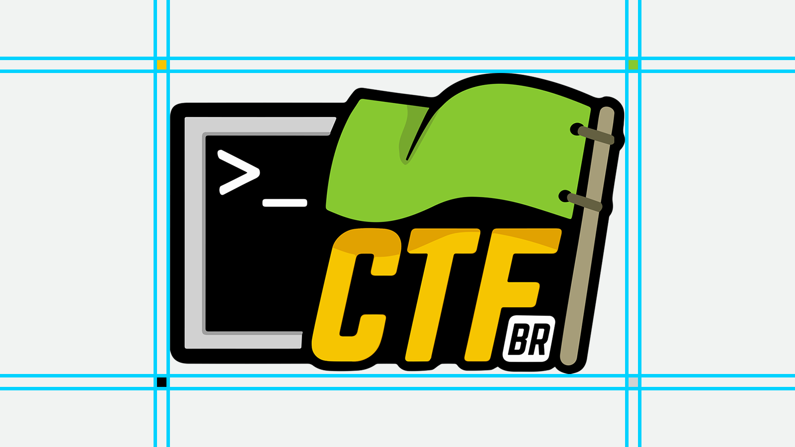

# CTF-BR - Branding


<!-- Social media buttons -->

[![alt text][1.1]][1]
[![alt text][2.1]][2]


<!-- links to social media icons -->
<!-- no need to change these -->

<!-- icons with padding -->

[1.1]: http://i.imgur.com/tXSoThF.png (twitter icon with padding)
[2.1]: http://i.imgur.com/P3YfQoD.png (facebook icon with padding)


<!-- links to your social media accounts -->
<!-- update these accordingly -->

[1]: https://twitter.com/ctfbr
[2]: https://www.facebook.com/capturetheflagbr


Repositório com todo o material gráfico do projeto CTF-BR
----------------

Por favor, consulte esse repositório para mais informações sobre os itens mostrados a seguir.

O logo do CTF-BR usado como assinatura em todas as nossas comunicações. Gostaríamos que ele fosse instantaneamente reconhecível, então a consistência é importante. Não o edite, altere, distorça, repinte ou reconfigure.


Por favor, use nosso logo de duas cores na maioria dos casos. Em circunstâncias especiais utilize a marca nominal em preto sólido ou branco e preto. 




Certifique-se de que o logo esteja corretamente espaçado.




``` r
Qualquer dúvida só entrar em contato comigo
```
[@TheZakMan](https://web.telegram.org/#/im?p=@TheZakMan)

